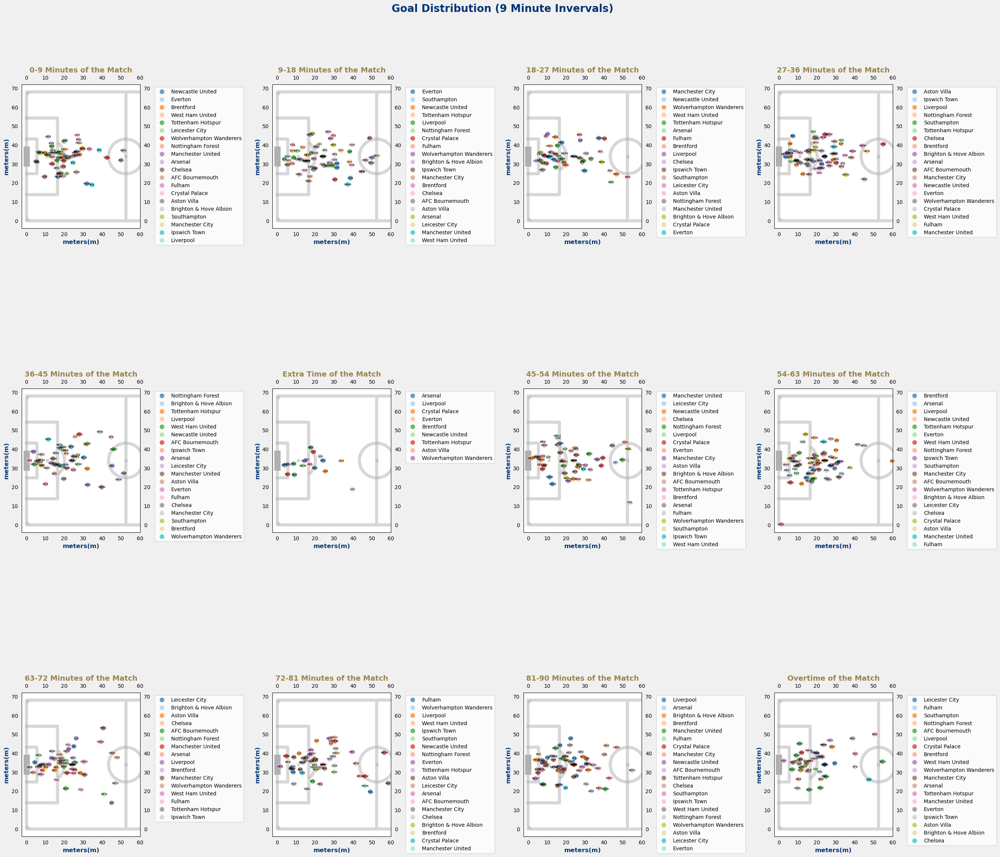

# ENGLISH PREMIER LEAGUE (EPL) SEASON 2024-2025, ANALYSIS OF GOALS SCORED

## 1. Project Overview
A usual EPL season last from August to May of the next year. This analysis is looking at the current EPL 2024-25 season from August 2024 up to February 2025, which can provide statistical answers for the remaining of the season. 

### Current EPL Standings on February 20th, 2025
 
Figure 1. EPL standings posted on February 20th. The current top 5 teams are Liverpool, Arsenal, Nottingham Forest, Manchester City, and AFC Bournemouth.
## 2. Research question
The general question to be answered is when should one predict a player to score. 
This will be looked at through multiple steps:
1. What other numerical features in the data correlate to goal scoring?
2. At what time in the game have most goals happened?
3. Where in the field do most players score from?

### Questions to Keep in mind:
1. Analysis of home vs away team scores
2. How do top teams or players compare to overall statistics?
3. What other events in the match are relevant?
4. Corners that end in goal?
5. Markers for shots vs goals scored

## 3. Describe source of data
The data used for this project was downloaded from Kaggle: 
https://www.kaggle.com/datasets/excel4soccer/espn-soccer-data
This dataset contains detailed soccer match data in 2024-2025 season, compiled from ESPN soccer data API into csv files containing:
30,000+ Match fixtures information, including: Match lineups, Play-by-play information, Key events, Commentary, Team statistics, Player statistics, and more.

Narrowing down the focus of this research, different csv files were compiled into a single file that looks at all the EPL matches played on the 2024-25 season from 2024-08-16 to 2025-02-21

The columns include: 
* match_id = a specific 5 digit id that identifies the match played
* game_date = year, month, day, and hour the match started [British Summer Time (BST)]
* team_name = Name identified to one of the 20 current EPL teams
* team_abb = 3 digit abbreviation for each team
* team_id = ID identified to one of the 20 current EPL teams
* home_team_id = ID identified to the team that is playing at home
* away_team_id = ID identified to the team that is playing away from home
* home_team_won = Shows True if the home team won the game or False if they lost or tied
* home_team_score = Number of goals scored by the home team
* away_team_score = Number of goals scored by the away team
* period = 1 for first-half or 2 for second-half
* clock = Minute marker of the match
* seconds = Second marker of the match
* player = Name of player
* play_id = ID identified to a specific type of play that was performed (ex: pass, shot, tackle, goal, save...)
* key_play_id = ID identified to a specific type of key play that was performed (ex:goal, shot, goal attempt...)
* playtype_id = A shorted ID identified to a specific type of play (ex: pass, shot, tackle, goal, save...)
* events = Short description from commentary on what just happened
* goal_scored = Value of 1 if a goal was scored or 0 if it is another type of key play that is not a goal. Null values indicate that it is neither
* fieldpositionX = X-coordinate position on the field that the player is at 
* fieldPositionY = Y-coordinate position on the field that the player is at
* fieldPosition2x and fieldPosition2y = Unsure of the meaning of these values

## 4. Describe how you cleaned and transformed data
### Searching through the Databse

Figure 2. Image of how the database would look like for all the files gathered from Kaggle's ESPN soccer data.
##### Highlighted in yellow are the tables that were extracted using SQLite3 Editor on VSC. Highlighted in red are the primary keys that were used to JOIN the desired tables along with their respective columns (green dots). Query utilized is saved in the references folder as match_player_plays_sqlite3-query.

### Parsing game_date column and creating additional columns
#### It was necessary to change the game_date column to the datetime data type to further create the columns:
* year
* month
* day
* hour

### Removing null values from the clock column
* Null values were removed from the clock column, especially because it a single row

### Fill in all null values for the goal_scored column
* Having 1 meaning goal scored and zero meaning no goal scored, it makes correlations easier to analyze

### Changing the clock data type and creating bins
* The clock data type was initially set as an object that includes extra time added to the 45 and 90 minute marks. 
* The column was transformed to the integer type so that the x-values can be used to track goal scoring over time and be able to include over time as separate intervals. The data was also added to 9' interval bins for further analysis.

## 5. Key insights

What visualizations do we need to understand your topic?
Show objective specific visualization(s)
What visualizations display your results
Tell us what (if anything) you recommend

### Features Affecting Goal Scoring

Figure 3. It shows the most relevant correlation values found in the data
#### There does not seem to be any relevant correlations between match time and goal_scoring.
#### High correlations do appear for field positions, shots, and goals scored which will the focus of the analysis. 

### Most Likely Minute to Score

Figure 4. Goal Percentage Distribution per minute match among EPL matches during the 2024-25 season
#### Looking at Figure 4, the graph experiences a fairlly normal distribution without much skewness. There does not seem to be any extreme irregularities to show a more predictable minute to score. The KDE line does show the probability of values across the match, where the highest peaks represents the modes of the data or highest probabilities of scoring.

### Most Likely Position to Score

### Identifying the Types of Plays to Determine Which Plays are Correlated with Opportunities

## Future Recommendation/Areas of Study
How to contribute to the project (optional)

##### Data to support this question:
* Focusing only on key plays, which removes of null values. 
* Main outliers are found in home_team_score and away_team_score, which we will be avoiding on this question.
* High positive correlation between: 
    * hour and key_play_id
    * year and key_play_id
    * goal_scored and fieldpositionX
    * goal_scored and fieldpositionY
* High negative correlation between:
    <!-- * goal_scored and seconds -->
    * month and key_play_id

#### This findings should help us answer:
* What part of the season shows that a player is more likely to score a goal?
* What month shows that a player is more likely to score a goal?
* What hour of the day shows that a player is more likely to score a goal?
<!-- * What minute of the match shows that a player is more likely to score a goal?  -->
* What player position shows that a player is more likely to score a goal?
