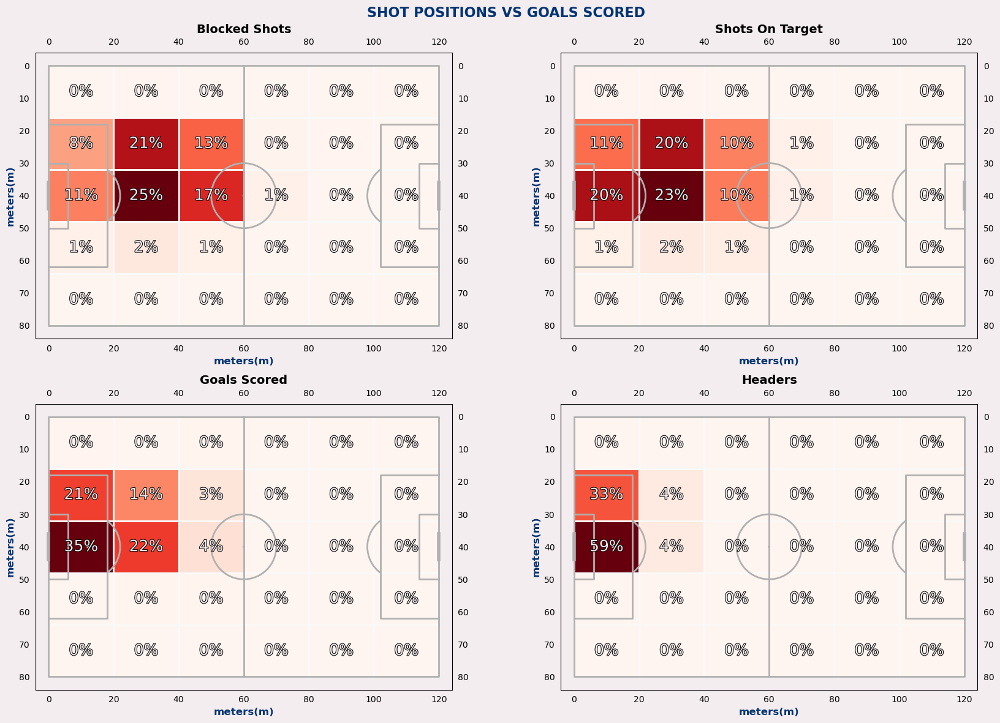

## _SEASON 2024-2025, SCORING ANALYSIS_ 

# **Project Overview**
A usual EPL season last from August to May of the next year. This analysis is looking at the current EPL 2024-25 season from August 2024 up to February 2025, which can provide statistical answers for the remaining of the season. 

### _Current EPL Standings on February 20th, 2025_
  
Figure 1. EPL standings posted on February 20th. The current top 5 teams are Liverpool, Arsenal, Nottingham Forest, Manchester City, and AFC Bournemouth.
# **Research Question**
The general question to be answered is when and where are goals happening. 
This will be looked at through multiple steps:
1. What other numerical features in the data correlate to goal scoring?
2. At what time in the game have most goals happened?
3. Where in the field do most players score from?
4. Any other factors that contribute to goal scoring or that could enhace goal scoring?

# **Description of Data**
The data used for this project was downloaded from [Kaggle](https://www.kaggle.com/datasets/excel4soccer/espn-soccer-data).
It contains detailed soccer match data from the 2024-2025 season, compiled from ESPN soccer data API into csv files containing:
30,000+ Match fixtures information, including: Match lineups, Play-by-play information, Key events, Commentary, Team statistics, Player statistics, and more.

Narrowing down the focus of this research, different csv files were compiled into a single file that looks at all the EPL matches played on the 2024-25 season from 2024-08-16 to 2025-02-21

### The columns include: 
* match_id = a specific 5 digit id that identifies the match played
* game_date = year, month, day, and hour the match started [British Summer Time (BST)]
* team_name = Name identified to one of the 20 current EPL teams
* team_abb = 3 digit abbreviation for each team
* team_id = ID identified to one of the 20 current EPL teams
* home_team_id = ID identified to the team that is playing at home
* away_team_id = ID identified to the team that is playing away from home
* home_team_won = Shows True if the home team won the game or False if they lost or tied
* home_team_score = Number of goals scored by the home team
* away_team_score = Number of goals scored by the away team
* period = 1 for first-half or 2 for second-half
* clock = Minute marker of the match
* seconds = Second marker of the match
* player = Name of player
* play_id = ID identified to a specific type of play that was performed (ex: pass, shot, tackle, goal, save...)
* key_play_id = ID identified to a specific type of key play that was performed (ex:goal, shot, goal attempt...)
* playtype_id = A shorted ID identified to a specific type of play (ex: pass, shot, tackle, goal, save...)
* events = Short description from commentary on what just happened
* goal_scored = Value of 1 if a goal was scored or 0 if it is another type of key play that is not a goal. Null values indicate that it is neither
* fieldpositionX = X-coordinate position on the field that the player is at 
* fieldPositionY = Y-coordinate position on the field that the player is at
* fieldPosition2x and fieldPosition2y = Unsure of the meaning of these values

# **Cleaning and Transforming Data**
## 1. Searching through the Databse
 
Figure 2. Image of how the database would look like for all the files gathered from Kaggle's ESPN soccer data.
#### _Highlighted in yellow are the tables that were extracted using SQLite3 Editor on VSC. Highlighted in red are the primary keys that were used to JOIN the desired tables along with their respective columns (green dots). Query utilized is saved in the references folder as match_player_plays_sqlite3-query. Datasets colected are saved in the sorted folder under data._

## 2. Parsing game_date column and creating additional columns
#### It was necessary to change the game_date column to the datetime data type to further create the columns:
* year
* month
* day
* hour

## 3. Removing null values from the clock and player columns with their respective rows
* Null values were removed from the clock column, especially because it a single row

## 4. Fill in all null values for the goal_scored column
* Having 1 meaning goal scored and zero meaning no goal scored, it makes correlations easier to analyze

## 5. Changing the clock data type and creating bins
* The clock data type was initially set as an object that includes extra time added to the 45 and 90 minute marks. 
* The column was transformed to the integer type so that the x-values can be used to track goal scoring over time and be able to include over time as separate intervals. The data was also added to 9' interval bins for further analysis.

## 6. Install mpl soccer and adjust the x and y positions to fit the coordinates of a standard 105 by 68 meter pitch
* EPL pitch sizes will be used later for the analysis so it would be best to fit our data now on two new columns: xtimes105 and ytimes68 for the respective fieldpositionX and fieldPositionY features.

## 7. Identify different playtype_id and create new columns of the type of plays that involve goal scoring
##### _The new columns created, identified by their playtype_id and new column name are:_
* playtype_id: 70 ==> pure_goal
* playtype_id: 137 ==> header_goal
* playtype_id: 98 ==> penalty_goal
* playtype_id: 173 ==> volley_goal
* playtype_id: 97 ==> own_goal
* playtype_id: 138 ==> free_kick_goal

# **Key Insights**

## Features Affecting Goal Scoring
 
Figure 3. The most relevant correlation values found in the data
#### _There does not seem to be any relevant correlations between match time and goal_scoring. High correlations do appear for field positions, play types, and goals scored which will the focus of the analysis._

## Most Likely Minute to Score
 
Figure 4. Goal Percentage Distribution per minute match among EPL matches during the 2024-25 season
#### _Looking at Figure 4, the graph experiences a fairlly normal distribution without much skewness. There does not seem to be any extreme irregularities to show a more predictable minute to score. The KDE line does show the probability of values across the match, with some high peaks around the 30 minute mark of the first half, and the 57 minute mark of the second half. There is an individual highest peak of the histogram at the 87th minute mark that accounts for 2.2% of the goals._

## Most Likely Position to Score
 
Figure 5. Scatterplot of shots and goals scored, where goals scored are shown as red crosses and shots as green dots
#### _Looking at the figure 5, some notable fidnings are that shot distribution seems very similar thoroughout the whole match. Frequency of shots and goals are much lower on extra time because of less minutes being played. From visual inspection, it seems that the 63-72m interval experiences the most spread out goals along the y-axis and pass the 40 meter mark. That is a time to increase pressure on those high wings. Looking at a kdeplot will provide a better understanding of where goals are concentrated._

 
Figure 6. KDE plot showing the density of goals scored
#### _The KDE plot confirms our inference on goals scored in the 63-72min of the match. High goal scoring concentrations are mostly high between the penalty box and the 30m mark. Overtime does seem to show a smaller range, high concentration aroud the penalty shot mark up to the 25m mark. The assumption would be that defending teams are defending tight by the goalkeeper, and attacking teams are not taking as many risks shooting from far. Also, noting that goal concentration seems to be opening up around the start of the second half up until the 63min interval where it begins to narrow again, likewise at the 27-36min interval._

 

## Different Forms to Score
 
Figure 7. Scatterplot showing the different types of plays and the goals that were scored during all matches
#### _Across all time intervls, we can see that pure shots are the most frequent way that goals are scored. However, looking at other play types, we see that header goals are overtaking the 18m mark in the 27-36min, 54-63min, and overtime. It looks like volleys sort of make an appearance mostly within the 18m mark; they are the least relevant closer to the end of each half. Own goals are as expected within the penalty box, and penalties have a fixed position, so it is difficult to calculate their frequency since they overlap._ 

##

 
Figure 8. Heatmap comparing shots that were not converted into goals (shots off target and shots on target) along with headers that were converted into goals against goals scored.
#### _Both shots off target and shots on target signal to the highest percentage being in the middle (20-40m on the x-axis), meaning that most shots coming from this position did not end up in goals. Goals scored show that most goals have been scored right inside the middle of the penalty box (0-20m from the x-axis) as it is the easiest place on the field to tap the ball and score. An interesting finding is that while most headers were scored in the middle of the penalty box, 33% of headers were scored near the first post on the right side of the attacking team; likewise only 11% of shots on target and 8% of blocked shots were taken from this position. Looking at the goals scored, we see that 21% of goals are scored in that same position, not a small number and should not go unnoticed. These findings allow us to see that this area of the field is being under utilized or perhaps defended so well that players are not able to shoot at all, however, a high quantity of chances taken from this position are ending up in goals._ 

# **Final Thoughts**

The KDE plot showed a more spread out pattern of goals on the 27-36min mark and the 45-63min mark, which happen to include the peaks from the distribution plot. This could lead to the assumption that a higher frequency of goals are happening when players are willing to take chances from areas just outside the penalty box.
The last graph showed us the opportunities that open up on those right wings. Needless to say this falls the most on the feet of those right wingers, or possibly even more those left footer right wingers who are used to go high, come inside and score goals.

# **Future Recommendation/Areas of Study**
* Perform the same analysis on other leagues to see if patterns differ from this one. The ESPN databse has access to all other leagues and the SQL query can be modified to get their data imported instead of EPL.
* Look at the home and away wins based on type of shots, shot positions, and goals scored. Might need to gather additional features from the database. 
* It might be possible to adjust the query to gather play by play data of players in the same team. This could help analyze passing and position patterns of each team.
* Since there was a high correlation between home_team_won and home_team_score, regression models could be made to analyze how many goals home teams usually get when they win (predictive analysis)
* The positions identified as 2X and 2Y also had high correlation with other features, so identifying what these features are might be helpful (assumption is that they could be positions on the goal)
* Two other datasets are also foud in the sorted folder that might be useful to analyze: one has player stats throughout the whole year and the other has team stats per match (less rows in this dataset).

